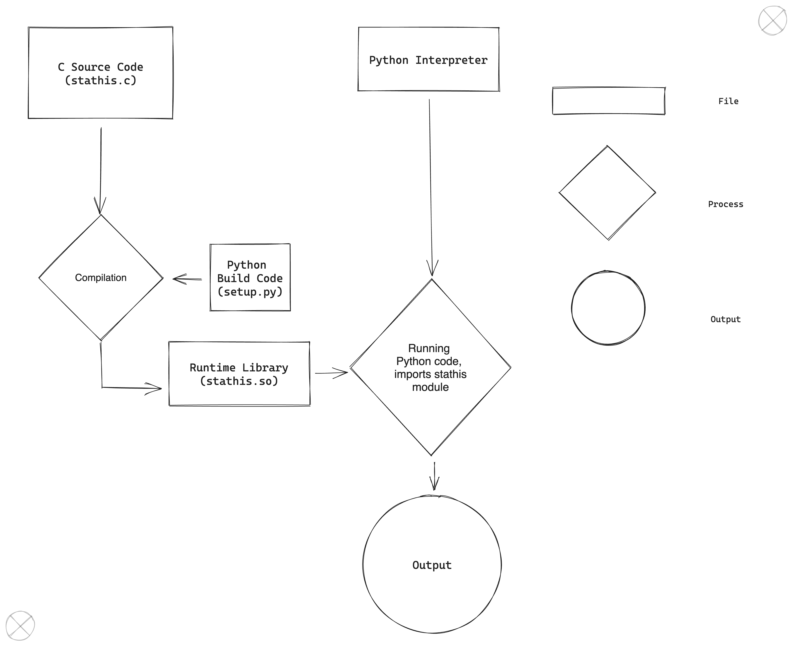

# Demo Module for Python Written in C

Write a simple C/C++ function and call it from Python. The same
should be true for CUDA code.

```py
import stathis

stathis.say_hello()
foo = stathis.add(5, 3)
print("foo:", foo)
```

Below is a simple diagram that shows the main project structure.

The only code that we write, is the `setup.py`, and `stathis.c` files. The rest is autogenerated from the [setup.py](#1-first-i-made-a-file-with-the-setuppy-script) script

```
.
├── README.md
├── example.py  <---- demonstrating the python module
│
└── src         <---- directory where we are actually coding/building the module
    │
    ├── build   <---- compiled code that gets included in runtime
    │
    │   ├── lib.macosx-13-arm64-cpython-311
    │   │   │
    │   │   └── stathis.cpython-311-darwin.so   <---- runtime library
    │   └── temp.macosx-13-arm64-cpython-311
    │       └── stathis.o
    ├── dist
    │   └── stathis-1.0-py3.11-macosx-13-arm64.egg
    │
    ├── setup.py    <---- build tool
    │
    ├── stathis.c   <---- module C source code
    │
    └── stathis.egg-info
        ├── PKG-INFO
        ├── SOURCES.txt
        ├── dependency_links.txt
        └── top_level.txt
```

The C code is compiled from `setup.py`, and that produces a runtime library `stathis.so`.
That then gets included by the interpreter when the python script calls it

## Steps:
### 1. First I made a file with the `setup.py` script:
```python
from setuptools import setup, Extension

stathis = Extension('stathis', sources=['stathis.c'])

setup(
    name='stathis',
    version='1.0',
    description='This is a demo package',
    ext_modules=[stathis],
)
```

This just declares a variable named `stathis`, that holds the name of our module, and the source files for it.

It then passes it to the setup function, that can compile it and install it for us, by running
<span id="bash">
```bash
python3 setup.py build
python3 setup.py install
```
</span>

So in a way, the `setup.py` file, is now our makefile

### 2. Write the C Code:
     
Only header file that we need to include is:
```C
#include <Python.h>
```
The rest is managed by the python API.

In the rest of the file, there are 4 other things:

1. The actual method of our module:
    ```C
    static PyObject* stathis_say_hello(PyObject* self, PyObject* args) {
        printf("Hello, world!\n");
        Py_RETURN_NONE;
    }
    ```
    This says that we have a function named `stathis_say_hello`, that returns a `static PyObject*`,     and takes arguments `(PyObject* self, PyObject* args)`

    The next line is just a hello world print, which is where we'd add anything else that might want    our method to do.

    Lastly, we run the macro `Py_RETURN_NONE`. Python Methods in C, always need to return a python  object, but if you don't have anything of value to return, then you just run the macro (Macros are   something like functions that are run by the compiler), and return nothing.

2. We then need to create a "dictionary", that will hold the name, corresponding function, any flags and documentation, of our C functions. This is basically a mapping of the C function, to the Python methods.
    ```C
    static PyMethodDef stathis_methods[] = {
        {"say_hello", (PyCFunction)stathis_say_hello, METH_NOARGS, stathis_say_hello_docs},
        {NULL, NULL, 0, NULL}
    };
    ```
    This dicitionary always has to end with NULLs.
3. The definition of the Python module, which takes a name, documentation (in this case NULL), size allocated for errors (I haven't looked into this one much to be able to explain well what it is), and the dictionary that we created in the step above
    ```C
    static struct PyModuleDef stathis_module = {
        PyModuleDef_HEAD_INIT,
        "stathis",
        NULL,
        -1,
        stathis_methods
    };
    ```

4. The initialization of our module. To my understanding, this "instanciates" the module, intializes variables, allocates memory, and does so depending on the OS that we're on
    ```C
    PyMODINIT_FUNC PyInit_stathis(void) {
        return PyModule_Create(&stathis_module);
    }
    ```
### 3. We can now run the setup script as shown above

[Run the bash commands](#bash)
### 4. Use as normal

```python
import stathis

stathis.say_hello()
```